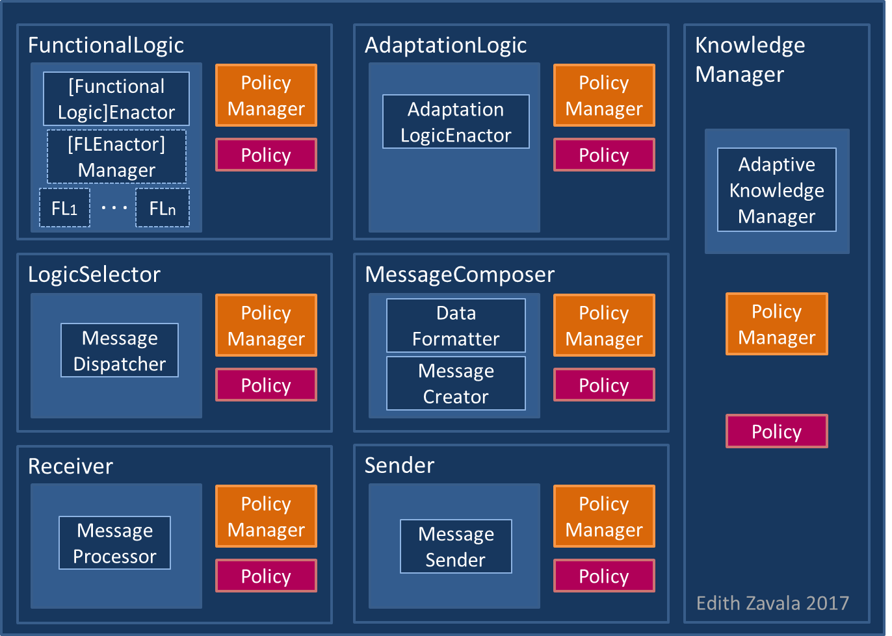

# LoopA 
(**A**daptive MAPE-K feedback **Loop**)

### Description:
LoopA is a framework for developing adaptive MAPE-K feedback loops. 

### Repository structure (under loopa/loopa/src/main/java/org/loopa/):
- Generic folder: Contains the interfaces and abstract classes that define the structure and behavior of a MAPE-K feedback loop element as well as the components that compose it (element sub-folder). Moreover, contains the structural and behavioral definition of a policy and its manager (documents sub-folder).
- Comm folder: Contains de definition of a message. Messages are used for sharing information among the components of a MAPE-K feedback loop element.
- Element folder: Contains the extensions and instantiations of the components of a MAPE-K feedback loop element, as well as their internal modules (see figure below for details). 
- Monitor, Anlyzer, Planner, Executer and Knowledge base folders: Contains the instantiations of the MAPE-K feedback loop elements, respectively. 
- Autonomic manager folder: Contains an instantiation of a complete adaptive MAPE-K feedback loop.

The figure below shows the components (and their modules) of an adaptive MAPE-K element.

This implementation of LoopA is licensed under the [Apache License, Version 2.0](http://www.apache.org/licenses/LICENSE-2.0)

**Main contact:** Edith Zavala (<zavala@essi.upc.edu>)
