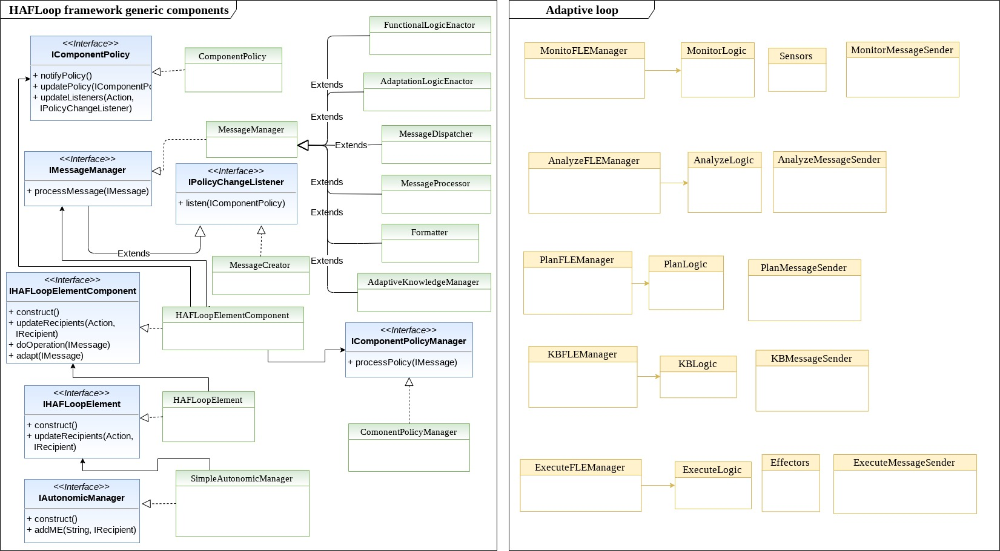

# HAFLoop
(**H**ighly **A**daptive **F**eedback control **Loop**)

### Description:
HAFLoop is a framework for developing adaptive MAPE-K feedback loops for self-adaptive systems. It makes it easy to create full or partially adaptive loops for Java-based applications, accelerating the implementation process. HAFLoop framework provides a series of components that implement the generic functionalities of an adaptive loop and an esqueleton that guides the implementation of the application-dependent components.

### The primary goals of HAFLoop are:
- Enable adaptation capabilities to MAPE-K loops
- Support the efficient adaptation of loop elements
- Reduce code repetition through components reusability
- Accelerate and distribute the implementation of adaptative loops for SASs
- Support adaptive loops with various (de)centralization levels

### Main components of HAFLoop framework (under loopa/loopa/src/main/java/org/loopa/):

The HAFLoop framework provides the following generic modules:
- Adaptive autonomic manager (i.e., adaptive feedback loop)
- Adaptive MAPE-K element (Monitor, Analyze, Plan, Execute, Knowledge base)
- Adaptive MAPE-K element component (Receiver, Logic selector, Sender, Message processor, Knowledge manager, Functional and Adaptation Logic)
- Adaptive MAPE-K element component's message and policy managers
For each element component a different implementation of a message manager is provided. An asynchronous communication module based on messages is also provided. Moreover, the mechanisms required for independently and efficiently manage loop's operation and adaptation processes is also provided. Each module consists of an Interface, and Abstract class and (in some cases) an implementation. Therefore, the framework can be use as it is, or be modified and extended by other proposals.

### System requirements:
- Java 1.8 or greater
- Gradle 4.5 or greater

### Getting started:
1) Clone this repository
2) Add the HAFLoop framework to your project
3) Implement the Functional Logic Enactor Manager interface for each elements' functional logic and the corresponding specific logic(s)
    - setConfiguration. This method should implement the (re)assigment of the configuration variables used for performing the elements' main functionality, i.e., their main logics. For instance, in the case of the Monitor, an example of configuration variable could be the monitoring frequency. The setConfiguration method is automatically called at runtime when an element adaptation is requested.
    - setComponent. The implementation of this method should set the element component to which this subcomponent belongs to. It is called by parent components during the setup of the element and is useful at runtime for structural adaptation (the getComponent method would tell the manager to which component it belongs at any time).
    - processLogicData. This is the main method of this component and it should implement a dispatcher service that selects at runtime to which logic a specific message should be sent to be processed.
  

This implementation of LoopA is licensed under the [Apache License, Version 2.0](http://www.apache.org/licenses/LICENSE-2.0)

**Main contact:** Edith Zavala (<zavala@essi.upc.edu>)
